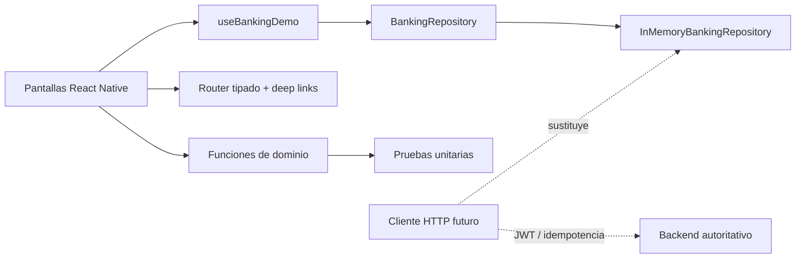

# Arquitectura de la demo

## Decisiones

- **Inversión de dependencias:** la UI consume `BankingRepository`; una API puede sustituir el repositorio en memoria sin cambiar pantallas.
- **Estado asíncrono explícito:** carga inicial, cancelación, error, reintento y envío bloqueado evitan estados ambiguos.
- **Navegación enlazable:** el router tipado soporta enlaces `aurea://`, limpieza de listeners y botón Atrás de Android.
- **Dominio puro:** importe, filtros, totales y fecha se prueban sin depender de la interfaz.
- **Idempotencia demostrable:** el repositorio devuelve la misma operación para una clave repetida y el formulario conserva su clave durante los reintentos.
- **Backend autoritativo en producción:** saldos, límites, fraude y ledger nunca se decidirían en el cliente.
- **Seguridad honesta:** la app no afirma implementar protecciones que una demo local no puede ofrecer.

## Camino a producción

Una implementación real introduciría navegación nativa, cliente HTTP tipado, TanStack Query, almacenamiento de secretos en Keychain/Keystore, biometría, observabilidad sin PII y pruebas E2E en dispositivos.
