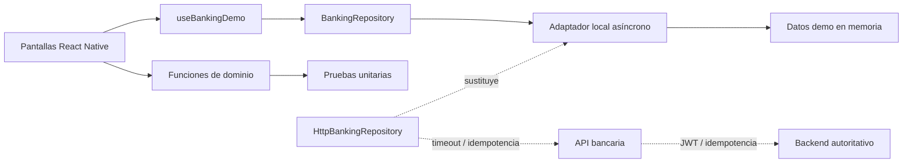

# Arquitectura de la demo

## Decisiones

- **Estado local deliberado:** hace que la demostración sea inmediata y reproducible.
- **Dominio puro:** importe, filtros, totales y fecha se prueban sin depender de la interfaz.
- **Inversión de dependencias:** el hook consume `BankingRepository`; un adaptador HTTP puede sustituir al local sin cambiar pantallas ni casos de uso.
- **Resiliencia observable:** carga, error, reintento, cancelación al desmontar e idempotencia forman parte del flujo demostrable, no solo del roadmap.
- **Navegación enlazable:** el esquema `aurea://` permite abrir las cinco secciones; una evolución a React Navigation conservaría esas rutas públicas.
- **Frontera HTTP verificable:** el adaptador HTTP propaga cancelación y timeout, mapea fallos y envía la clave de idempotencia como cabecera; se prueba con transporte inyectado sin depender de red.
- **Backend autoritativo en producción:** saldos, límites, fraude y ledger nunca se decidirían en el cliente.
- **Seguridad honesta:** la app no afirma implementar protecciones que una demo local no puede ofrecer.

## Camino a producción

Una implementación real introduciría stacks de navegación nativa, cliente HTTP tipado, TanStack Query, almacenamiento de secretos en Keychain/Keystore, biometría y observabilidad sin PII. El escenario Maestro incluido sirve como contrato inicial, pero debe ejecutarse en dispositivos reales dentro de CI antes de considerarse una barrera de entrega.
