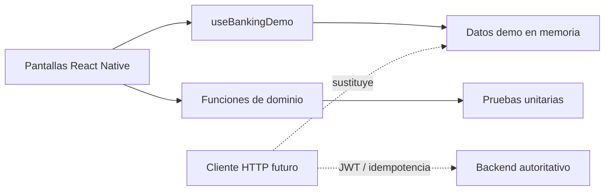

# Arquitectura de la demo

## Decisiones

- **Estado local deliberado:** hace que la demostración sea inmediata y reproducible.
- **Dominio puro:** importe, filtros, totales y fecha se prueban sin depender de la interfaz.
- **Backend autoritativo en producción:** saldos, límites, fraude y ledger nunca se decidirían en el cliente.
- **Seguridad honesta:** la app no afirma implementar protecciones que una demo local no puede ofrecer.

## Camino a producción

Una implementación real introduciría navegación nativa, cliente HTTP tipado, TanStack Query, almacenamiento de secretos en Keychain/Keystore, biometría, observabilidad sin PII y pruebas E2E en dispositivos.
